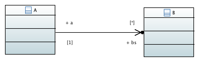

Exploring C++ representation of 1-to-many relationship
======================================================
By Randall Britten

Here is some code that is the result of experimenting with ways of representing a one-to-many relationship in C++11.

Some features:

- Children only created through owning parent so that they are managed by parent.
- std::shared_ptr used for memory management.
- Attempt at const correctnes

To do:
- What about removing a child?
